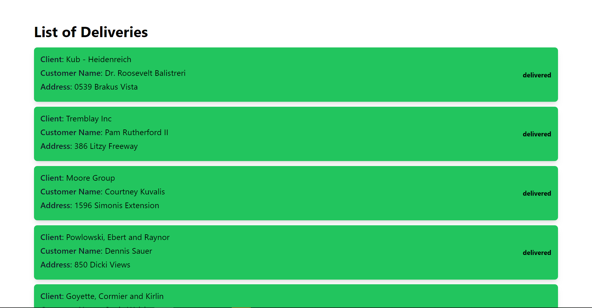

# Delivery Manager

A React MVP to handle delivery management.

The Delivery Manager is a React Based Application that manages delivery of goods to various customers by various clients. It is very dynamic as it is connected to an Api endpoint and data is passed to the `DeliveryList` component using the `deliveries` props. Api calls are made in the `getDeliveries`, `getDelivery`, `makeActive` and `updatingDelivery` async actions using redux.

&nbsp;

## Features

- ✔️ List Deliveries
- ✔️ Update Delivery Details
- ✔️ Activate Delivery,
- ✔️ Page Routing,
- ✔️ Update Delivery Status

&nbsp;

## Built With

- JavaScript, TypeScript, React
- Hooks, Redux, Redux thunk.
- TailWindCss, Css modules.
- Jest, React-testing-library, Jest-axe.
- Axios

&nbsp;

## Live Demo

[Live Demo Link](#)

&nbsp;

## Getting Started

To get a local copy up and running follow these simple example steps.

### Prerequisites

To run this project, you will need to have `node`,`npm` or `yarn`, `TypeScript` already installed locally

### Setup

`Clone the project and cd into the directory`

### Install

run `npm install` or `yarn install` to install all the dependencies of the project

### Usage

run `npm start` or `yarn start` to get the project running

open browser and navigate to `http://localhost:3000/`

&nbsp;

### Customizations

The styles are written using TailWindCss.

To tweak react components navigate to `/src/components`

To access application theming navigate to `tailwind.config.js`

To access global styles navigate to `/src/styles/index.css`

See [tailwindCss](https://tailwindcss.com/docs/theme) documentation for how to theme and tweak relevant styles

&nbsp;

## Tests

Mostly Integration are written.

To access tests n react navigate to `/src/__test__`

### Running Tests

run `npm test` or `yarn test` to get the tests running

#### Analysis report

&nbsp;

## Deployment

run `npm build` or `yarn build` to generate build folder. You can now serve the build folder on any static server. for more information visit [https://create-react-app.dev/docs/deployment/](https://create-react-app.dev/docs/deployment/).

&nbsp;

## Authors

👤 **Author**

- Github: [solomonakp](https://github.com/solomonakp)
- twitter: [@dev_chuck](https://twitter.com/dev_chuck)

&nbsp;

## 📝 License

This project is [MIT](lic.url) licensed.
